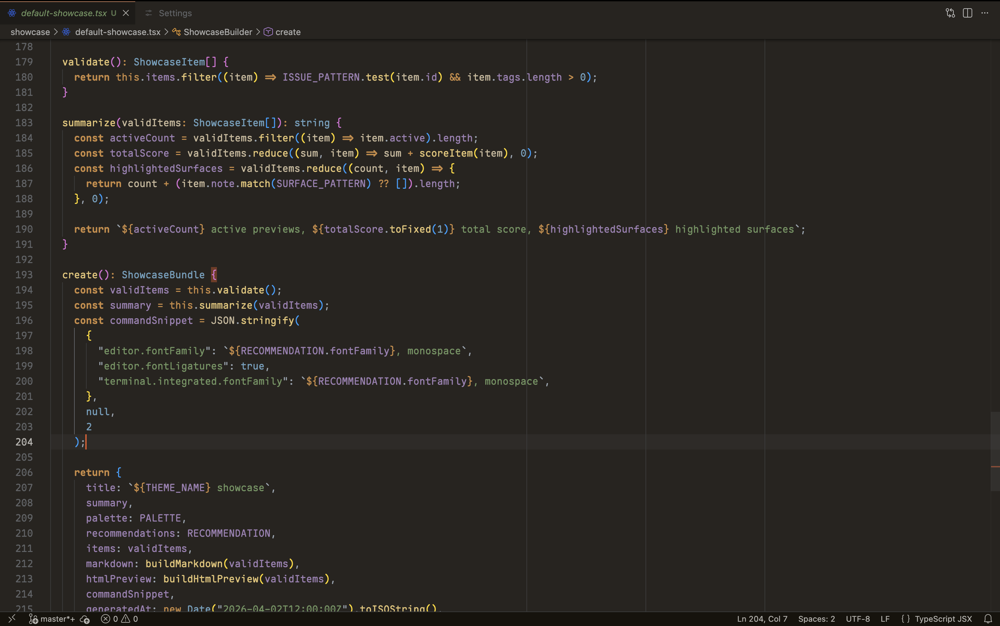

# Warm Dark Theme

Warm Dark is a warm-toned dark theme designed to be easy on the eyes with muted contrast and soft syntax colors.

Warm Dark pairs especially well with Maple Mono and `wilfriedago.vscode-symbols-icon-theme`.

## Included Theme

- `Warm Dark`

## Install

1. Install the extension.
2. Open `Preferences: Color Theme`.
3. Select `Warm Dark`.
